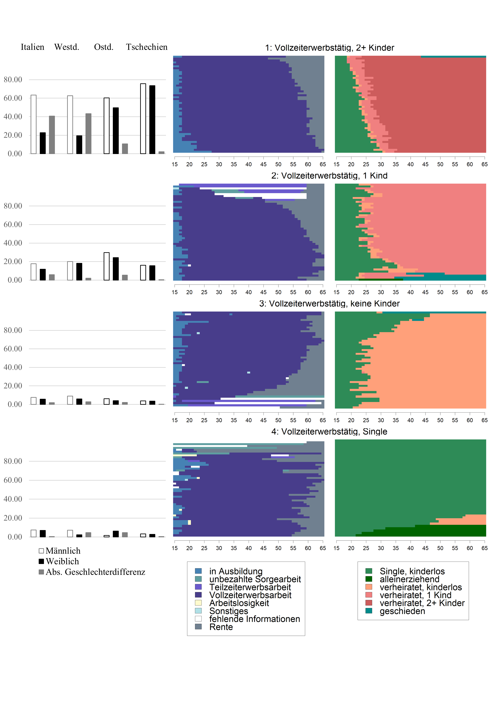
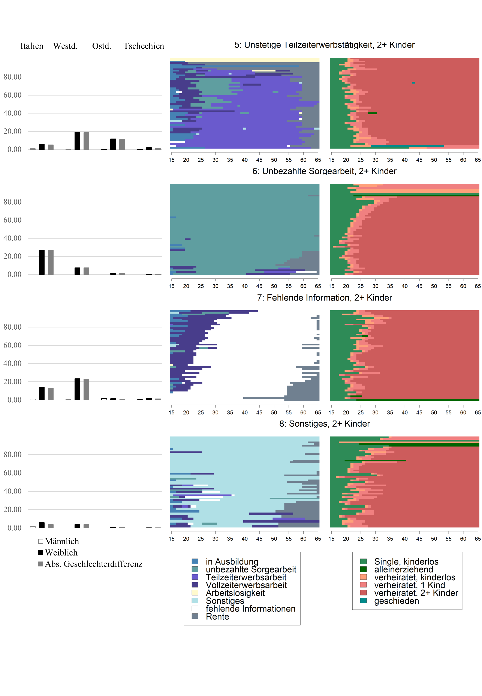
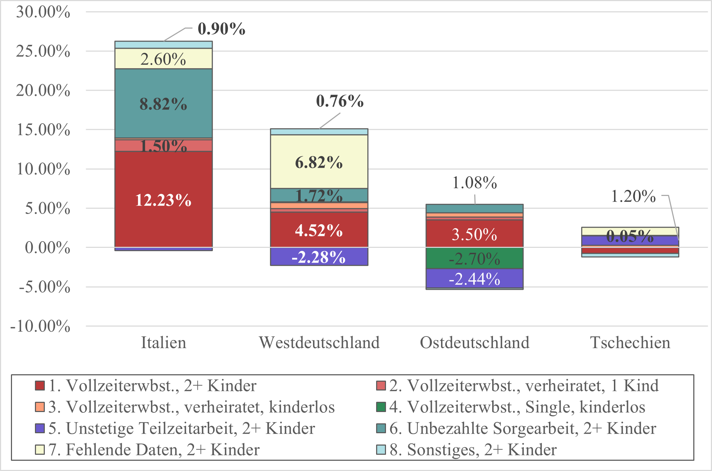

# Der Zusammenhang von Familien- und Arbeitsbiografien und Rentensystemen mit dem Gender Pension Gap – geschlechtsspezifsche Rentenlücken in Europa aus der Lebensverlaufsperspektive
Carla Rowold, Oxford 

Unten sind Abbildungen 3-5 zu finden.
Hier der Link zum Original-Artikel: [Link zum Artikel](https://www.deutsche-rentenversicherung.de/SharedDocs/Downloads/DE/Zeitschriften/DRV_Hefte_deutsch/2022/ausgewaehlter_artikel_heft_2_rowold.pdf?__blob=publicationFile&v=3)

## Abbildung 3: Lebensverlaufsmuster 1 bis 4 und Verteilung darauf nach Geschlecht und Ländern

Quelle: eigene Darstellung auf Basis des Analysesamples und Daten von SHARE und SHARELIFE.

## Abbildung 4: Lebensverlaufsmuster 5 bis 8 und Verteilung darauf nach Geschlecht und Ländern

Quelle: eigene Darstellung auf Basis des Analysesamples und Daten von SHARE und SHARELIFE.

## Abbildung 5: Anteil der einzelnen Lebensverlaufsmuster an gesamter Rentenlücke nach Ländern, erklärter Teil der Dekomposition

Anmerkungen: fett = Signifkanzlevel von mindestens 10 Prozent; nur erklärte Anteile der Dekomposition dargestellt.
Quelle: eigene Darstellung auf Basis des Analysesamples und Daten von SHARE und SHARELIFE.
